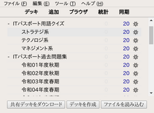

<!-- Document: readme.md

	ITパスポート変換器のマニュアル

	Metadata:

		id - 6a0c7922-9366-4e32-adf5-581664bf07c2
		author - <qq542vev at https://purl.org/meta/me/>
		version - 0.1.0
		date - 2023-06-23
		since - 2023-06-23
		copyright - Copyright (C) 2023-2023 qq542vev. Some rights reserved.
		license - <CC-BY at https://creativecommons.org/licenses/by/4.0/>
		package - convert-it-passport

	See Also:

		* <Project homepage at https://github.com/qq542vev/convert-it-passport>
		* <Bag report at https://github.com/qq542vev/convert-it-passport/issues>
-->

# ITパスポート変換器

[ITパスポート試験ドットコム](https://www.itpassportsiken.com/)にて公開されている、[ITパスポート](https://www3.jitec.ipa.go.jp/JitesCbt/index.html)の過去問題集と解説文及び用語クイズを任意の形式に変換します。現在対応している変換形式は [Anki](https://apps.ankiweb.net/) に対応した CSV です。

## Anki でITパスポートの過去問を学ぶ

[GitHub Release](https://github.com/qq542vev/convert-it-passport/releases/latest) から最新版をダウンロードして、ファイルを解凍してください。ディレクトリ内にある `./release/past-exam-question-to-csv.sh` と `./release/word-quiz-to-csv.sh` を実行します。問題と解答をダウンロードして、CSV ファイルへの変換が行われます。引数が無い場合、全ての問題と解答がダウンロードされます。コマンドライン引数にオプションをつけることで、一部のみをダウンロードすることもできます。`--help` をつけて実行し、詳細を確認してください。

プログラムが正常に動作するためには [POSIX Utilities](https://pubs.opengroup.org/onlinepubs/9699919799/idx/utilities.html), [GNU Wget](https://www.gnu.org/software/wget/), [XMLStarlet](https://xmlstar.sourceforge.net/) がご使用のコンピューターにインストールされている必要があります。

ディレクトリ内にある `collection.colpkg` を Anki 
にインポートします。細分化された空のデッキが取り込まれますので、各デッキ内に先程作成されたCSVファイルを読み込んでいきます。カードタイプはそれぞれ適切なものを選択してください。

[[!ファイルの読み込み](images/thumbnails/anki-menu-read.png)](images/anki-menu-read.png "ファイルの読み込み") [[!CSV ファイルのインポート](images/thumbnails/anki-read-option.png)](images/anki-read-option.png "CSV ファイルのインポート")
